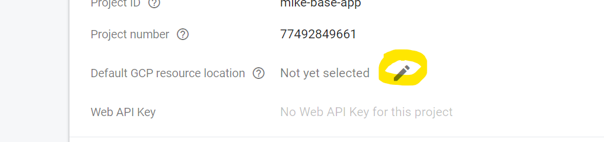

# Base App.

My starting point for React development using TypeScript, Firebase, Tailwind CSS, Flowbite React and other goodies.

## Getting Started

1. Clone this repo: `git clone git@github.com:mikeknapp/base_app.git`
2. Rename directory to your liking
3. `cd <dir name>`
4. Delete .git folder, then `git init`
5. [Install Node.js](https://nodejs.org/en/download), if not already installed
6. Install Yarn `npm install --global yarn`, if not already installed
7. `yarn install` to grab all required dependencies
8. Start Parcel: `yarn start`
9. Go to https://console.firebase.google.com/ and set up a new Firebase project
10. Create a new web config, and copy the config values to `src/firebase.ts`
11. Inside Firebase, enable Google login
12. Inside Firebase, setup Firestore
13. Go to your Firebase settings:
    
14. Set your project location (mirror where you selected Firebase to be setup):
    
15. Edit `.firebaserc` and update the project name
16. Visit http://localhost:1234 in your browser
17. Your browser will automatically update as you make edits to the code
18. Make your initial commit
19. `yarn upgrade --latest` to upgrade all required dependencies and check everything works ok

## Customizing

1. Replace the favicon.ico in `/src/images`
2. Add a page title to `/src/index.html`
3. (Optional) change the Google font from Open Sans in `/src/index.html` and `/src/styles.css`
4. Add your Firebase config to `src/firebase.ts`

## Deploying

1. Install Firebase Tools `npm install --global firebase-tools`
2. Ensure you're logged in to an account with access to our Firebase account `firebase logout && firebase login`
3. `yarn deploy`

## Tech Stack

- [Firebase](https://www.firebase.com) - Auth, DB, Analytics and more.
- [Parcel JS](https://parceljs.org/) - Build tool
- [React](https://react.dev/) - Rendering Engine
- [TypeScript](https://www.typescriptlang.org/) – Strongly Typed JavaScript
- [TailwindCSS](https://tailwindcss.com/) - CSS Library
- [Flowbite React](https://flowbite-react.com/) - UI Library
- [Zustand](https://github.com/pmndrs/zustand) - State-management
